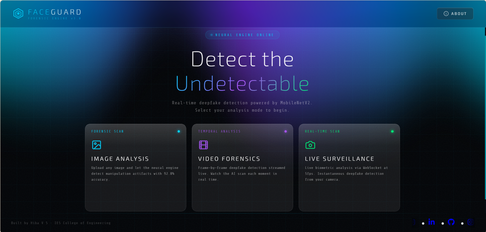

# FACEGUARD — Real-Time Deepfake Detection



**Real-Time Deepfake Detection & Identity Forensics System**

[](https://faceguard-ui.vercel.app)
[](https://faceguard-digital-forensic-system.onrender.com)
[](https://react.dev)
[](https://fastapi.tiangolo.com)
[](https://tensorflow.org)

> *Detect manipulation at the pixel level — image, video, and live camera.*

---

## ✦ Overview

FaceGuard is a full-stack deepfake detection system that leverages a fine-tuned **MobileNetV2** convolutional neural network trained on the **FaceForensics++** dataset. It supports three forensic analysis modes — static image analysis, frame-by-frame video streaming, and real-time webcam surveillance — all wrapped in a cinematic glassmorphism interface with WebGL Aurora backgrounds.

Built as a mini project at **IES College of Engineering, Thrissur** · Department of CSE (Data Science).

---

## ✦ Live Demo

🌐 **[https://faceguard-ui.vercel.app](https://faceguard-ui.vercel.app)**

> ⚠️ The backend runs on Render's free tier — first request may take **~50 seconds** to wake up.

---

## ✦ Features

| Feature | Description |
|---|---|
| 🖼️ **Image Analysis** | Upload any JPG/PNG/WEBP — get instant deepfake probability with animated biometric HUD overlay |
| 🎬 **Video Forensics** | Frame-by-frame SSE streaming analysis with temporal risk timeline chart |
| 📷 **Live Surveillance** | Real-time webcam deepfake detection via WebSocket at ~5fps with live risk gauge |
| 🎨 **Glassmorphism UI** | WebGL Aurora background, frosted glass panels, cinematic mode transitions |
| 📱 **Mobile Responsive** | Full mobile support with bottom navigation and adaptive layouts |

---

## ✦ Tech Stack

### Frontend
- **React 18** — component architecture
- **OGL** — WebGL Aurora background shader
- **Recharts** — temporal risk timeline visualization
- **Canvas API** — real-time biometric HUD rendering
- **CSS Glassmorphism** — `backdrop-filter`, frosted glass panels

### Backend
- **FastAPI** — async REST API + WebSocket server
- **TensorFlow / Keras** — model inference
- **OpenCV** — frame extraction and preprocessing
- **Docker** — containerized deployment on Render

### ML Model
- **Architecture**: MobileNetV2 (fine-tuned)
- **Dataset**: FaceForensics++ (FF++)
- **Accuracy**: 92.8%
- **Inference Speed**: 0.04s / frame
- **Input**: 224×224 RGB face crop

---

## ✦ Architecture

```
┌─────────────────────────────────────────────────────┐
│                   React Frontend                     │
│  Landing Page → Image / Video / Webcam Analysis     │
│  Canvas HUD · Recharts · WebGL Aurora               │
└────────────┬──────────────────────┬─────────────────┘
             │ REST (fetch)         │ WebSocket
             ▼                      ▼
┌─────────────────────────────────────────────────────┐
│                  FastAPI Backend                     │
│  /analyze/image  ·  /upload/video                   │
│  /analyze/video/stream (SSE)  ·  /ws/webcam         │
└────────────────────┬────────────────────────────────┘
                     │
                     ▼
┌─────────────────────────────────────────────────────┐
│            MobileNetV2 (TensorFlow)                  │
│   Preprocessing → Face Crop → Inference → Score     │
│   Temporal Smoothing → Verdict                      │
└─────────────────────────────────────────────────────┘
```

---

## ✦ Getting Started

### Prerequisites
- Node.js 18+
- Python 3.10+
- Docker (optional, for backend)

### 1. Clone the repository
```bash
git clone https://github.com/hiba-castellan/FaceGuard-Digital-Forensic-System.git
cd FaceGuard-Digital-Forensic-System
```

### 2. Backend setup
```bash
cd backend
pip install -r requirements.txt
```

Set environment variable:
```bash
# Windows
set MODEL_PATH=../models/faceguard_phase2_finetuned.h5

# macOS/Linux
export MODEL_PATH=../models/faceguard_phase2_finetuned.h5
```

Run the server:
```bash
uvicorn main:app --host 0.0.0.0 --port 8000 --reload
```

### 3. Frontend setup
```bash
cd frontend
npm install
```

Create `.env.local`:
```env
REACT_APP_API_URL=http://localhost:8000
```

Run the dev server:
```bash
npm start
```

Open [http://localhost:3000](http://localhost:3000) 🚀

### 4. Docker (backend only)
```bash
cd backend
docker build -t faceguard-backend .
docker run -p 8000:8000 faceguard-backend
```

---

## ✦ API Reference

| Endpoint | Method | Description |
|---|---|---|
| `/health` | GET | Model status check |
| `/analyze/image` | POST | Analyze image for deepfakes |
| `/upload/video` | POST | Upload video for processing |
| `/analyze/video/stream` | GET | SSE stream of frame results |
| `/ws/webcam` | WebSocket | Real-time webcam inference |

---

## ✦ Model Details

The model is a **MobileNetV2** pretrained on ImageNet and fine-tuned on FaceForensics++ — a benchmark dataset containing ~1000 original videos manipulated using four methods: Deepfakes, Face2Face, FaceSwap, and NeuralTextures.

```
Input  →  224×224 RGB
           ↓
      MobileNetV2 backbone
      (pretrained ImageNet weights)
           ↓
      Global Average Pooling
           ↓
      Dense(128, relu) + Dropout(0.5)
           ↓
      Dense(1, sigmoid)
           ↓
Output →  P(fake) ∈ [0, 1]
```

**Training details:**
- Optimizer: Adam (lr=1e-4)
- Loss: Binary Crossentropy
- Epochs: 20 (early stopping)
- Test Accuracy: **92.8%**

---

## ✦ Project Structure

```
FaceGuard-Digital-Forensic-System/
├── backend/
│   ├── main.py              # FastAPI routes
│   ├── model.py             # Model loading + inference
│   ├── requirements.txt
│   ├── Dockerfile
│   └── models/
│       └── faceguard_phase2_finetuned.h5
├── frontend/
│   ├── src/
│   │   ├── App.jsx                # Root — landing ↔ app transitions
│   │   ├── index.css              # Global glassmorphism styles
│   │   └── components/
│   │       ├── Aurora.jsx         # WebGL aurora background
│   │       ├── LandingPage.jsx    # Cinematic landing
│   │       ├── ImageAnalysis.jsx  # Image forensics mode
│   │       ├── VideoForensics.jsx # Video forensics mode
│   │       ├── WebcamScan.jsx     # Live surveillance mode
│   │       ├── RiskGauge.jsx      # SVG risk gauge
│   │       ├── useFaceMesh.js     # Canvas HUD renderer
│   │       └── LogoLoop.jsx       # Scrolling social links
│   └── package.json
├── docs/
│   └── banner.png
├── models/
├── train_model.py
├── fine_tune.py
└── README.md
```

---

## ✦ Deployment

| Service | Platform | URL |
|---|---|---|
| Frontend | Vercel (auto-deploy) | [faceguard-ui.vercel.app](https://faceguard-ui.vercel.app) |
| Backend | Render (Docker, Free tier) | [faceguard-digital-forensic-system.onrender.com](https://faceguard-digital-forensic-system.onrender.com) |

Push to `main` → Vercel auto-deploys frontend. Render auto-deploys backend on code changes.

---

## ✦ Security & Observability

During the final audit phase, several enterprise-grade hardening and observability features were added:

1. **Native OpenTelemetry Instrumentation**: 
   - Backend (`unified_api.py`) natively exports spans via `BatchSpanProcessor` to the console.
   - Frontend (`FrontendTracer.js`) uses `@opentelemetry/auto-instrumentations-web` to trace UI events, component loads, and `fetch` requests. 
   - W3C Trace Context headers (Baggage) propagate across CORS boundaries for end-to-end distributed tracing.
2. **WebSocket & CORS Hardening**: 
   - `OriginGuard` implemented in FastAPI to strictly block Cross-Site WebSocket Hijacking (CSWSH) and state-changing CSRF attempts from malicious origins.
   - Memory-exhaustion bounds placed on WebSocket frames to prevent DoS.
3. **Path Traversal Mitigation**: 
   - Video upload processing uses opaque UUIDs instead of trusting client-provided filenames, nullifying arbitrary file read/delete vulnerabilities.

---

## ✦ Author

**Hiba V S** · IES23CD008 · CSE Data Science · IES College of Engineering, Thrissur

[](https://github.com/hiba-castellan)
[](https://linkedin.com/)
[](https://instagram.com/)

---

## ✦ License

© 2026 Hiba V S · All rights reserved. This project is publicly visible for portfolio purposes. Copying, redistribution, or reuse of any part of this codebase without explicit written permission is not permitted.

---

*Built with React · FastAPI · TensorFlow · OGL · Deployed on Vercel + Render*
