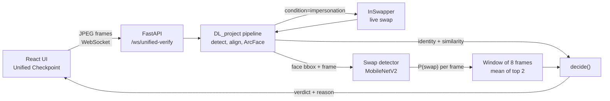

# Architecture

## Overview

Two models look at every frame, and one rule combines them.

- **ArcFace** (`buffalo_l`, via InsightFace) answers *who is this?* by comparing the face embedding to enrolled identities.
- **Swap detector** (MobileNetV2) answers *is this face synthetic?* from a crop of the face.
- **`decide()`** lets the detector veto an identity match. A convincing swap fools ArcFace, so ArcFace is never trusted alone.



## Request flow (`/ws/unified-verify`)

For each binary JPEG frame received (`unified_api.py`):

1. Drop empty frames and frames over 2 MB.
2. Run the DL_project pipeline: face detection, alignment, ArcFace embedding and match. With `condition=impersonation`, InSwapper first swaps the configured source identity onto the user's face, and *the swapped frame is what gets scored*. That is the frame a real attacker's camera feed would deliver.
3. Crop the face from the scored frame (35% margin, 224×224) and run the swap detector to get `P(swap)`.
4. Append `P(swap)` to a sliding window of 8. The decision statistic is the **mean of the two highest values** in the window. No face in a frame clears the window.
5. Call `decide()` and return JSON: verdict, reason, `P(swap)`, ArcFace similarity and threshold, and (for impersonation) the swapped frame so the UI can show it.

If an exception occurs, the handler sends an error message instead of freezing on the previous verdict.

## Verdict logic

Checks run top to bottom (`swapdet.decide`). The deployed threshold is **0.3** (`SWAP_THRESHOLD` in `unified_api.py`; the function's own default is 0.5).

| Order | Condition | Verdict |
|---|---|---|
| 1 | No face found | `NO_FACE` |
| 2 | `P(swap)` ≥ threshold | `ATTACK_BLOCKED` (even if ArcFace matched) |
| 3 | Fewer than 3 frames of evidence | `ANALYZING` |
| 4 | ArcFace did not match an enrolled identity | `UNKNOWN_IDENTITY` |
| 5 | Otherwise | `SECURE_VERIFIED` |

Two properties are deliberate and tested in `test_decide.py`:

- **Blocking is immediate.** A high `P(swap)` blocks on the first frame. Only a *positive* verification waits for 3 frames.
- **Fail closed at the boundary.** `P(swap)` exactly at the threshold blocks.

## Components

### Swap detector (`swapdet.py`)

| | |
|---|---|
| Network | torchvision MobileNetV2, single-logit head, dropout 0.2 |
| Input | 224×224 RGB crop in [0, 1]; ImageNet normalisation lives *inside* the model so L∞ budgets are in true pixel units |
| Weights | `models/swapdet_deployed.pt` (9 MB, tracked in git) |
| Training | `gen_swap_data.py` then `train_swapdet.py` |
| Training data | LFW identities and FaceForensics++ original frames. Fake class = the same face with another identity swapped in by InSwapper. Split by identity. |

**Which checkpoint is deployed.** `swapdet_deployed.pt` is byte-identical (same MD5) to `swapdet_clean.pt`, the standard-trained model. Adversarial-training variants exist in `models/` but were not deployed (see [Evaluation](evaluation.md#adversarial-training-variants)). Some comments in `swapdet.py` and `unified_api.py` still say "adversarially trained"; they are out of date.

### Identity pipeline (`DL_project/src/`)

Face detection, alignment, ArcFace embeddings, enrollment (`src/identity/`, `src/runtime/identity_pipeline.py`) and the InSwapper wrapper (`src/runtime/live_swap.py`). The API loads it as `LiveInferencePipelineV4` (`src/runtime/live_pipeline_v4.py`). The ArcFace match threshold (0.2445) was calibrated on validation data (`DL_project/experiments/final_evaluation/model_a_threshold.json`).

### API (`unified_api.py`)

One FastAPI app that mounts three things:

| Path | Source | Purpose |
|---|---|---|
| `/ws/unified-verify` | `unified_api.py` | The swap-vs-identity verdict described above |
| `/dl/*` | `DL_project/src/api/server.py` | Identity pipeline and enrollment |
| `/faceguard/*` | `FaceGuard-Digital-Forensic-System/backend/main.py` | Legacy image, video (SSE) and webcam analysis |
| `/`, `/health` | `unified_api.py` | Liveness |

### FaceGuard (bundled project)

An earlier, separate project (its own README and licence are in its folder): a Keras MobileNetV2 deepfake classifier trained on FaceForensics++. It powers the image, video and webcam tabs. **It does not take part in the swap verdict.** Its measured behaviour on this project's attack is in [Evaluation](evaluation.md#faceguard-keras-model).

### Frontend (`FaceGuard-Digital-Forensic-System/frontend/`)

React app with five tabs: Image, Video, Webcam, Deepfake Generator and **Unified Checkpoint** (the only tab that uses the verdict above). Development server on port 3005.

## Repository layout

The tree below is the standalone layout. Inside the `DL_project` repository this folder is `unified-swap-defense/` and `DL_project/` is the repository root.

```text
.
├── unified_api.py            # API entry point: verdict endpoint + mounts
├── swapdet.py                # Swap detector + decide()
├── gen_swap_data.py          # Build the swap/real dataset with InSwapper
├── train_swapdet.py          # Train clean / control / adversarial detectors
├── eval_system.py            # End-to-end attack success vs ArcFace + detector
├── eval_margin_attack.py     # Strong white-box attack on the detector
├── eval_randomized.py        # Randomized-transform defense under adaptive attack
├── eval_faceguard.py         # FaceGuard on FaceForensics++
├── eval_adversarial.py       # FaceGuard under swaps and FGSM/PGD
├── make_figures.py           # eval_results/summary.png
├── enroll_user.py            # Enroll a user from webcam or photos
├── make_demo_identity.py     # Export the "victim" identity photos
├── test_decide.py            # Verdict-logic assertions
├── smoke_unified.py          # Full-stack smoke test
├── bench_live.py             # Latency of the live path
├── models/                   # Swap-detector checkpoints (only deployed is tracked)
├── eval_results/             # JSON metrics, logs, figures
├── DL_project/               # ArcFace pipeline, identity enrollment, earlier research
├── FaceGuard-Digital-Forensic-System/   # Bundled earlier project + React UI
└── docs/                     # This documentation
```
