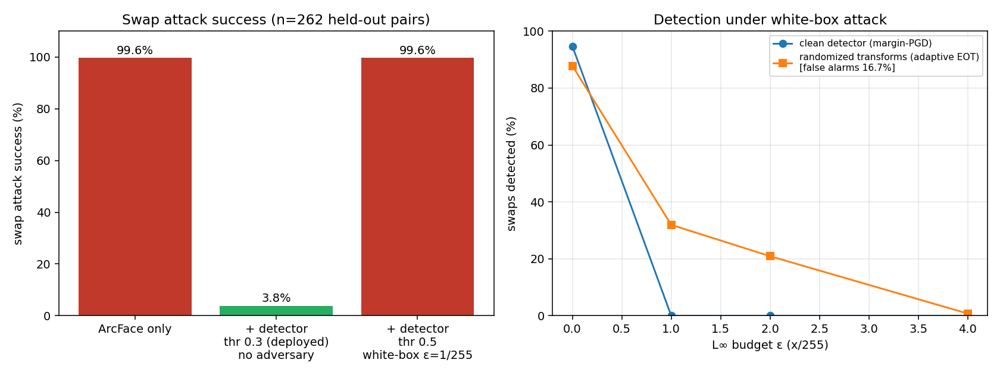

# Evaluation

Every number here comes from a file in `eval_results/`, or from a re-run noted below. Test sets are small (a few hundred images), so treat differences of a few percentage points as noise.

## Setup

| | |
|---|---|
| Attack | InSwapper (`inswapper_128`) swaps a source identity onto a target face |
| Data | LFW people and FaceForensics++ original frames (`gen_swap_data.py`) |
| Split | By identity (LFW person / FF++ video id), so no person appears in both train and test |
| Train | 1,886 real + 1,886 fake crops |
| Test | 263 real + 263 fake crops (262 pairs have recorded ArcFace similarities) |
| Detector | MobileNetV2, 224×224 face crops, deployed checkpoint = `swapdet_clean.pt` |
| ArcFace threshold | 0.2445, calibrated on validation (`model_a_threshold.json`) |

**Metric definitions.** *Swaps caught* = fraction of fake crops with `P(swap)` ≥ threshold. *Real flagged* = fraction of real crops with `P(swap)` ≥ threshold, i.e. a genuine user wrongly blocked on that frame. *Attack success* = the swap is accepted as the source identity by the full system (ArcFace accepts **and** detector does not flag).

## 1. ArcFace alone is not enough

| System | Attack success (n = 262) |
|---|---|
| ArcFace only | **99.6%** |

Source: `eval_results/system_results.json`. The swapped face is, to ArcFace, the person it impersonates.

## 2. Adding the swap detector (no adversary)

Per-frame results of the deployed detector on the held-out test crops:

| Threshold | Swaps caught | Real flagged | Note |
|---|---|---|---|
| 0.8 | 90.5% | 1.1% | |
| 0.5 | 94.7% | 4.2% | End-to-end attack success 5.3% (`system_results.json`) |
| **0.3** | **96.2%** | **6.1%** | **Deployed.** End-to-end attack success 3.8% (10 of 262). From `eval_deployed.py`. |

At the deployed 0.3, 3.8% of swaps get through the whole system (ArcFace accepts **and** the detector does not flag): 10 of 262 pairs. Measured by `eval_deployed.py` on `swapdet_deployed.pt`, written to `eval_results/deployed_operating_point.json`.

Other quality numbers for the same model (`swapdet_results.json`, n = 526): accuracy 95.2% at 0.5, AUC 0.993.

### Why 0.3 and a window

The threshold was lowered from 0.5 after real webcam frames of one demo user scored lower than the test set did: a swap produced `0.97, 0.94, 0.96, 0.93, 0.51, 0.35` across six frames, while genuine frames scored 0.01–0.07. The deployed rule therefore uses the mean of the top two scores over eight frames.

> [!NOTE]
> That calibration used **six frames from one person on one camera.** It is a reasonable choice for the demo, not a validated operating point. No systematic live-camera evaluation exists in this repository.

Per-frame "real flagged" is **not** the rate at which a real user is blocked over a session. That rate depends on the window and was not measured.

## 3. A white-box attacker defeats the detector

An attacker who knows the detector and can add an L∞-bounded perturbation to the face crop:

| Attack | ε | Swaps still caught |
|---|---|---|
| FGSM | 1/255 | 20.2% |
| FGSM | 4/255 | 24.3% |
| PGD-10 | 1/255 | **0.0%** |
| PGD-10 | 4/255 | **0.0%** |
| Margin-PGD (50 steps × 2 restarts) | 1, 2, 4 /255 | **0.0%** |

Sources: `swapdet_results.json`, `margin_attack_results.json`.

End to end, with the margin attack the swap is accepted **99.6%** of the time at every ε tested (`system_results.json`, `clean`), the same as with no detector at all.

> [!WARNING]
> These attacks perturb the detector's input crop digitally and assume the perturbation does not change ArcFace's similarity. This is the detector's worst case, not a demonstrated attack on a physical camera feed. It does show the detector has no adversarial robustness.

### Adversarial-training variants

PGD adversarial training was tried (ε = 4/255 and 1/255, 10 epochs, 50% clean + 50% adversarial). It raised robustness and wrecked usability:

| Model | Swaps caught | **Real flagged** | PGD-10 ε=4/255, swaps caught |
|---|---|---|---|
| Clean (**deployed**) | 94.7% | **4.2%** | 0.0% |
| Clean fine-tune control | 92.8% | 2.7% | 23.9% |
| Adversarial, ε = 4/255 | 95.4% | **62.4%** | 78.7% |
| Adversarial, ε = 1/255 | 98.5% | **66.2%** | 76.8% |
| Adversarial, ε = 1/255, adv. weight 0.25 | 98.9% | **67.3%** | 78.7% |

Source: `swapdet_results.json` (n = 526). At 0.5 these models block two thirds of genuine users, so none was deployed. Under the stronger margin attack they were still broken (attack success 31–76% depending on variant and ε, `system_results.json`).

The clean fine-tune control matters: it shows how much of the "robustness" in a naive comparison comes from extra training rather than from adversarial examples.

### Randomized transforms

Averaging the detector over random input transforms (K = 8) was tried against an *adaptive* attacker (EOT, 30 PGD steps):

| | Clean swaps caught | Real flagged | Caught at ε=1/255 | ε=2/255 | ε=4/255 |
|---|---|---|---|---|---|
| Plain detector | 94.7% | 4.2% | 0.0% | 0.0% | 0.0% |
| Randomized | 87.8% | 16.7% | 31.9% | 20.9% | 0.8% |

Source: `randomized_defense_clean.json`. It helps a little at ε = 1/255, costs clean accuracy, quadruples false alarms, and gives nothing at 4/255. It is not deployed.



*Left panel: ArcFace alone, the deployed detector at 0.3 with no adversary (3.8%), and the detector at 0.5 under a white-box attack at ε = 1/255 (`system_results.json`). Right panel: detection of the plain and randomized detectors under white-box attack.*

## FaceGuard Keras model

The bundled FaceGuard classifier was evaluated for context. It is **not** used in the swap verdict.

| Test | Result | Source |
|---|---|---|
| FF++ (1,000 real + 1,000 fake), threshold 0.4, fine-tuned weights | accuracy 61.5%, AUC 0.72, recall 92.2% | `faceguard_ffpp_metrics_faceguard_phase2_finetuned.json` |
| Same | only **30.7%** of real faces accepted as real (693 false positives) | same |
| InSwapper pairs (n = 150) | flags 90.7% of swaps but also **74%** of real faces | `faceguard_adversarial.json` |
| FGSM ε = 1/255 on caught fakes | detection falls from 100% to 2.2% | same |
| PGD-10 ε = 1/255 | detection 0% | same |

A classifier that flags most real faces looks good on "swaps detected" and is useless in practice. Its own README describes it as a mini project; these numbers are what it does on this project's data.

## Reproduce

```bash
python gen_swap_data.py [N_LFW] [N_FFPP]      # needs InSwapper weights and FF++ frames under eval_data/
python train_swapdet.py 10                    # clean, control, adversarial (eps 4/255)
python train_swapdet.py 10 1                  # adversarial only, eps 1/255
python train_swapdet.py 10 1 0.25             # ... with adversarial loss weight 0.25
python eval_system.py                         # -> eval_results/system_results.json
python eval_deployed.py                       # -> eval_results/deployed_operating_point.json (deployed weights, thresholds 0.3 / 0.5 / 0.8)
python eval_margin_attack.py                  # -> margin_attack_results.json
python eval_randomized.py                     # -> randomized_defense_clean.json
python eval_faceguard.py                      # FaceGuard on FF++
python eval_adversarial.py                    # FaceGuard under swaps and FGSM/PGD
python make_figures.py                        # -> eval_results/summary.png
python test_decide.py                         # verdict-logic assertions
```

`data/` and `eval_data/` are git-ignored, so the datasets must be regenerated. `gen_swap_data.py` is memory-hungry; running it together with GPU training exhausted the Windows paging file during development.
